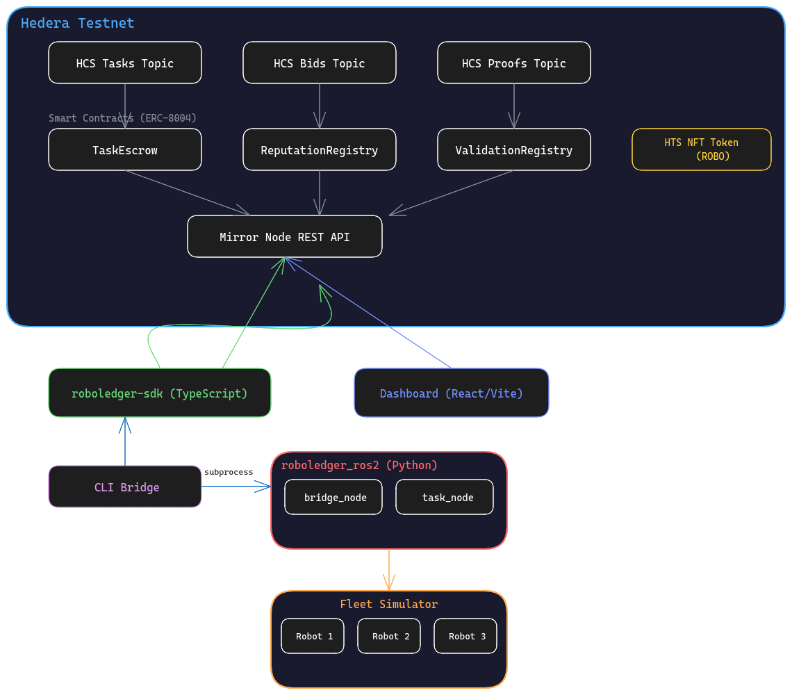

# RoboLedger

**ERC-8004 for Physical Robots on Hedera**

Decentralized trust protocol that gives autonomous robots on-chain identity, verifiable reputation, and multi-party proof validation — so machines can work, prove, and get paid without middlemen.

## The Problem

Autonomous robots are powerful yet isolated. There is no shared, trustless way for a robot to:
- **Prove its identity** — who built it, is it certified, is its firmware legit?
- **Get hired for work** — no neutral marketplace where robots compete for tasks
- **Prove it did the work** — self-reported completion with no independent verification
- **Get paid automatically** — payment flows through intermediaries with 30-day settlement

Projects like OpenMind ($20M raised, Pantera Capital), Konnex ($15M raised), and peaq (60+ DePIN apps) are attacking this on custom L1 chains. **Nobody has built it on Hedera.**

## Why Hedera

| | Hedera | peaq | Ethereum |
|---|---|---|---|
| **Identity** | HTS NFT with native KYC/freeze/metadata keys | Custom DID pallet + RBAC pallet | ERC-721 + custom access control |
| **Data logging** | HCS message ($0.0001) | Storage pallet → IPFS → CID on-chain | Calldata ($0.50-2.00) |
| **Payments** | Native HBAR in smart contract | Tether WDK subprocess | ERC-20 + gas auction |
| **Finality** | 3 seconds (aBFT) | 6 seconds (Aura) | 12+ seconds (probabilistic) |
| **Fair ordering** | Guaranteed (no MEV) | No guarantee | MEV vulnerable |
| **Steps to log proof** | 1 (HCS message) | 5 (hash → sign → IPFS → CID → storage pallet) | 1 (but expensive) |

## Architecture

The system has five components that compose into a single protocol:


**How it flows:**

1. **Robots register** by minting an HTS NFT. The token's native keys assign roles: manufacturer mints (supply key), certifier approves operation (KYC key), safety authority can ground instantly (freeze key), robot updates its own firmware hash (metadata key). No custom smart contract needed for identity.

2. **Clients post tasks** to an HCS topic as JSON messages ($0.0001 each). Robots listen via mirror node, evaluate if their capabilities match, and bid on the same topic. Hedera's aBFT consensus guarantees fair ordering — first valid bid wins, no front-running.

3. **The escrow contract locks HBAR** when a task is created. The client assigns a robot. The contract tracks how many validator approvals are required before settlement.

4. **The robot executes the task** and streams proof-of-completion waypoints to an HCS proofs topic. Each proof gets a Hedera consensus timestamp that neither party can dispute.

5. **Independent validators** (other robots, the client, staked third parties) call `validateTask` on the escrow contract. When the threshold is met, the robot calls `completeTask` — the contract verifies the validation count, releases HBAR to the robot, and auto-submits positive reputation feedback to the ReputationRegistry.

6. **If the deadline passes** without completion, anyone can trigger a refund. The contract returns HBAR to the client and records negative reputation feedback for the assigned robot.

## ERC-8004 Three Registries

[ERC-8004](https://eips.ethereum.org/EIPS/eip-8004) defines three on-chain registries for trustless agent interaction. We implement all three for physical robots:

| Registry | Implementation | Purpose |
|----------|---------------|---------|
| **Identity** | HTS NFT with KYC/freeze/metadata keys | Who is this robot? Is it certified to operate? |
| **Reputation** | `ReputationRegistry.sol` — auto-feedback on settlement/refund | Can I trust this robot? What's its track record? |
| **Validation** | `ValidationRegistry.sol` — multi-party threshold approval | Did the robot actually complete the physical work? |

The `TaskEscrow` contract wires all three together: it checks identity (only KYC-approved robots can be assigned), gates payment on validation threshold, and auto-records reputation on every outcome.

## Project Structure

```
robo-hedera/
├── packages/
│   ├── sdk/           # TypeScript SDK wrapping @hashgraph/sdk
│   ├── contracts/     # Solidity: TaskEscrow, ReputationRegistry, ValidationRegistry
│   ├── cli/           # CLI bridge for ROS2 subprocess calls
│   └── dashboard/     # React/Vite dashboard + architecture presentation
├── ros2_ws/src/
│   ├── roboledger_interfaces/   # Custom ROS2 msg/srv definitions
│   ├── roboledger_ros2/         # Bridge node + task node
│   └── roboledger_simulator/    # 3-robot fleet simulator
└── scripts/
    ├── setup-testnet.ts         # Create accounts, topics, NFTs
    ├── deploy-contract.ts       # Deploy all 3 contracts
    └── demo.ts                  # Full lifecycle demo
```

## Quick Start

```bash
pnpm install

# 1. Configure .env with Hedera testnet operator credentials
cp .env.example .env

# 2. Setup testnet resources (accounts, topics, NFT token, mint robots)
pnpm setup

# 3. Deploy smart contracts
npx tsx scripts/deploy-contract.ts

# 4. Run the full demo (38 seconds, ~$0.39)
npx tsx scripts/demo.ts

# 5. Start dashboard
cd packages/dashboard && pnpm dev
```

## Testnet Deployment

| Resource | ID | HashScan |
|----------|-----|----------|
| Robot NFT Token | `0.0.8348082` | [View](https://hashscan.io/testnet/token/0.0.8348082) |
| TaskEscrow | `0.0.8349515` | [View](https://hashscan.io/testnet/contract/0.0.8349515) |
| ReputationRegistry | `0.0.8349495` | [View](https://hashscan.io/testnet/contract/0.0.8349495) |
| ValidationRegistry | `0.0.8349503` | [View](https://hashscan.io/testnet/contract/0.0.8349503) |
| Tasks HCS Topic | `0.0.8348079` | [View](https://hashscan.io/testnet/topic/0.0.8348079) |
| Proofs HCS Topic | `0.0.8348081` | [View](https://hashscan.io/testnet/topic/0.0.8348081) |

## Tech Stack

- **Hedera** — HCS, HTS, Smart Contracts, Mirror Node
- **Solidity 0.8.28** — 3 contracts, interfaces, custom errors, CEI pattern
- **TypeScript** — SDK, CLI, dashboard
- **ROS2 Jazzy** — Python bridge nodes + fleet simulator
- **React + Vite + Tailwind** — Dashboard with live testnet data
- **Hardhat** — 35 passing contract tests

## License

MIT
